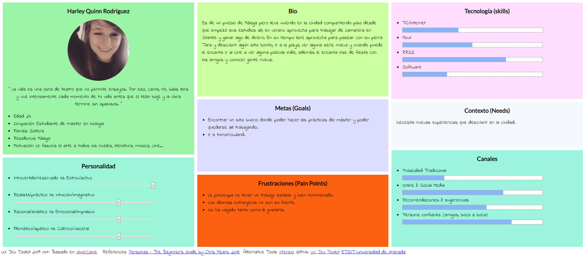

 1.a Competitive Analysis
-----

**Eatwith**: 
La podemos encontrar tanto en versión web como en app. Esta aplicación es para buscar o
crear experiencias culinarias, tanto tours gastronómicos como clases de cocina. Solo
tendremos que registrarnos, de forma muy rápida y sencilla y ya podremos ocupar el rol que
queramos. La interfaz es muy amigable y visualmente muy bonita, aunque cuenta con
mucha cantidad de información e imágenes, son de gran ayuda a la hora de decir.

**Meetup**:
También la podemos encontrar tanto en versión web como en app. En esta aplicación
podremos buscar o crear eventos de cualquier tipo. Solo tendremos que registrarnos, de
forma muy rápida e intuitiva, la información está organizada y explicada de forma muy clara,
tanto para buscar como para crear algún evento. A mi parecer su aspecto es un tanto sobrio
pero tiene muchas características, lo que ha veces puede llevarte perderte por la interfaz.
Meetup es la más conocida, la de más recorrido, la más versátil y la que personalmente yo
he utilizado y aunque visualmente no sea mi estilo, era la candidata que mejor me parecía,
por tanto ha sido la elegida.

 1.b Persona
-----

**Harley Quinn Rodriguez**: 
Esta persona es una joven que está en una etapa de la vida en la que empieza a pensar en
su futuro y en el empleo que quiere desarrollar con los estudios que ha realizado. Todavía
sigue bajando a casa de sus padres muchos findes, principalmente para no tener que
cocinar y llevarse tapers de comida. A nivel económico empieza a querer independizarse al
cien por cien de sus padres pero sabe que es complicado si se mete en el ámbito de la
investigación, por eso quiere empezar haciendo unas prácticas en alguna empresa para ver
que tal le va. Muchos de sus amigos han salido fuera de la ciudad en busca de otras
oportunidades, pero para ella no es problema salir y conocer gente nueva para lo que surja.
Su perra es una parte fundamental en su vida y a sus compañeras de piso también les
encanta aunque de vez en cuando la lie.

**Francisco Fernandez**: 
Esta persona es un hombre con un recorrido laboral aceptable que se encuentra cómodo
con su pareja y contento del lugar donde vive, pero que la personalidad de la gente que le
rodea en un su oficina no le gusta o comparte demasiado, por eso suele realizar la mayoría
de actividades de ocio con su novia Samantha. Sus expectativas son crecer en la empresa
y por tanto echa más horas de las que debería y eso le frustra. Hacer ejercicio y
preocuparse por su alimentación ocupa un lugar importante en su vida ya que de pequeño
sufrió de sobrepeso dado su metabolismo lento y no quiere verse mal.
Es una persona muy familiar y le gusta mantener conversaciones con sus amigos de toda la
vida. A veces le gustaría volver a Cadiz y trabajar allí pero sabe que en Madrid tiene un
puesto fijo y gana más dinero.

 1.c User Journey Map
----

He escogido situaciones variadas con personas con objetivos diferentes que pueden ocurrir
con facilidad.

**Harley Quinn Rodriguez**: 

**Francisco Fernandez**: 

 1.d Usability Review
----
Valoración 77/100.

Creo que la aplicación está muy completa en cuanto a funcionalidad pero es muy sosa y
simple en algunos apartados, también debería mejorar la interacción con el usuario, por tanto lo mejor es quizá la ayuda disponible y lo peor la busqueda de actividades.
[Usability-review](Usability-review.pdf)
