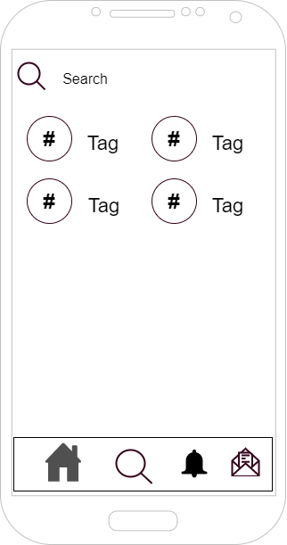

 2.a Feedback Capture Grid
----

Al poder ver actividades o eventos sin estar logeados mejoramos la forma de difusión para llegar a
cualquiera.
La forma de buscar y poder seguir entidades y tags mejora la interfaz(Forma de buscar parecida a la
que tiene instagram).
Mejoramos la conexión del usuario interesado con una pagina de inicio personalizada con los
eventos cercanos con las temáticas y entidades que haya escogido.
También mejoramos la forma de difusión con entidades o locales físicos del entorno para darse a
conocer o expandir mas su forma de difundir actividades o eventos. Un ejemplo seria una discoteca,
la cual se crearía un perfil validado, verificando su propiedad y con esto podría crear
actividades/anuncios de sus fiestas o eventos con su nombre , p.ej. Discoteca Vogue.

 2.b Tasks & Sitemap 
-----

He dividido al usuario logeado en los dos roles que se pueden dar de forma generalizada.

 2.c Labelling 
----

 2.d Wireframes
-----

