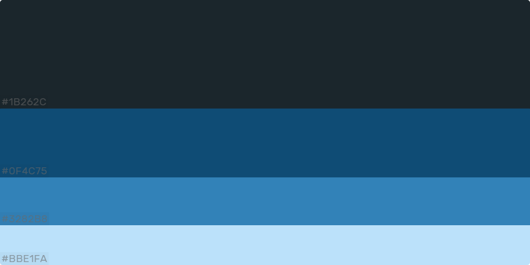

 3.a ¿Como se cuenta un UX-Case Study?
-----

Aqui analizaremos 

  3.b Logotipo
----

El logotivo ha sido creado con el programada de edicion gratuito GIMP.
Creo que es un logo versatil para usar en cualquier entorno como redes sociales...

 3.c Guidelines
----

Para el diseño he optado por una línea de diseño basada en los estándares que ofrece android.

He decidido utilizar una paleta con colores azulados , predominando el oscuro para un visionado que no moleste y otros más claros que aportan frescura.
Esta la he obtenido de Colorhunt donde se difunden distintas paletas de colores y se hace un ranking de las mismas.
https://colorhunt.co/palette/167893

Para la fuente he decidido utilizar “Open Sans” y sus variables, a través de la web de Google Fonts, ya que me parece que sigue una línea estilizada acorde para la aplicación.
https://fonts.google.com/

Para los iconos también sigo la misma línea que se utiliza en android.
https://www.flaticon.es/packs/android-app-3

  3.d Video
----

>>> Documente y resuma el diseño de su producto en forma de video de 90 segundos aprox
