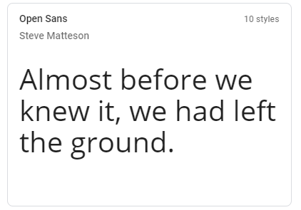
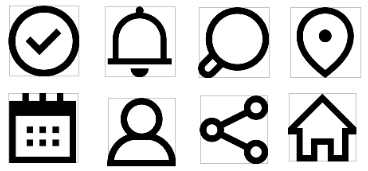

 3.a ¿Como se cuenta un UX-Case Study?
-----

En esta apartado se reflexionará sobre los métodos UX que ha puesto en práctica
MuseMap, una aplicación sobre el arte público y urbano.
https://blog.prototypr.io/musemap-street-art-app-ux-case-study-9bec6a99823b

Para desarrollar esta reflexión partiremos de los puntos que dicha aplicación ha tratado y los
iremos comparando con los nuestros.

Contextual Inquiry

Primero el equipo realizó una lluvia de ideas para hacer suposiciones sobre los posibles
usuarios objetivo y sus necesidades alrededor del producto principal de su aplicación que
son las obras de arte y sus artistas.

Contextual Users

Para contrastar más los gustos o características que habían asociado a estos usuarios
decidieron salir a los sitios objetivo para así ver cómo interactúa el público ante las obras.
Esta investigación está bien para hacerse un poco a la idea de cómo interactúa la gente real
en dichos entornos y hacerse una ligera idea de a que nos enfrentamos.

Competitive Analysis

En este caso lo que hicieron fue crear una tabla y comparar con otras aplicaciones que
promueven el arte y exposiciones de arte en la calle distintos apartados como
actualizaciones, filtros determinados de búsqueda, poder vincular a redes sociales, tener
obras favoritas, etc.
Y en cada una de las funcionalidades que consideraban relevantes escribían un si o no ,
dependiendo de si la aplicación tenía o no esa característica.
En este caso las comparación iniciales son mucho más exhaustiva que la nuestra,
comparando más aplicaciones y sacando bastantes características para hacer una
observación mucho más extensa, sacando a relucir de forma más clara a través de la tabla
las distintas funcionalidades de cada aplicación. Así pudieron ver las características que
implementan todos, como un mapa interactivo y puntos de acceso de arte para ser visitados
o una base de datos con la información sobre el artista el arte y las que se dejaban más de
lado, como las visitas de usuarios, la posibilidad de hacer votaciones, recomendaciones
personalizadas.
Como ya hemos comentado la comparación inicial es más extensa y mucho más profunda
que la nuestra, sacando las distintas funcionalidades que puede tener la aplicación. Sin
embargo nosotros en la Usability Review hacemos un recorrido por las diferentes apartados
globales de la aplicación y conseguimos sacar los defectos y virtudes principales de la
misma, esto puede ser más engorroso pero más adelante nos proporcionará mucha más
información para saber por dónde empezar. Esto es algo que los desarrolladores de
MuseMap no han hecho.

Empathy Map

Con esto los creadores desarrollaron una serie de suposiciones acerca de los usuarios,
como sus sensaciones, estímulos o acciones. Con esto consiguieron sacar diversas
conclusiones como que el arte público debe ser apropiado para el área y la audiencia. Todo
esto con el objetivo de crear un formulario y hacer las preguntas correctas o adecuadas
para que un grupo de personas las responda.

Affinity Mapping

Después de hacer el cuestionario a distintas personas, sintetizaron los datos obtenidos con
sus hipótesis iniciales y sacaron una serie de conclusiones que ya empezaban a ser de gran
utilidad.
Estos apartado son interesantes pero en mi opinión serían difícil de abordar en otras
circunstancias y creo que aunque se obtengan datos relevantes no son demasiados y nos
podríamos ahorrar el coste de todo este proceso para incidir en otros apartados que
considero más relevantes.

Users

Aquí como nosotros también decidieron crear a dos personas ficticias para identificar los
objetivos y puntos débiles de la app. Estos perfiles son similares y con objetivos parecidos,
ya que están basados en su usuario objetivo, por tanto los datos que nos arrojaran al
realizar el mapedaefaefae tampoco serán muy distintos.

User Journey Map y experience map

A diferencia de nosotros a la hora de realizar esto solo se centran en unos de los sujetos y
realizan un escenario donde no utilizan ninguna aplicación propuesta sino que montan un
ambiente que se centra en crear un historia alrededor de una obra de arte callejera, que es
el producto que gestionan.
Luego crean más escenarios con el mismo personaje para intentar abordar los diferentes
problemas que pueden surgir.

User flow

Aquí los desarrolladores empiezan a definir el flujo de los usuarios usando la aplicación. A
mi parecer un solo user flow que englobe todas las funcionalidades que quieren es muy
abstracto, en este caso muestran el flujo cuando se encuentra una obra de arte interesante
cerca y a partir de ahí obtiene instrucciones para llegar al lugar y toma una foto para
compartirla en las redes sociales.

Paper Prototype y Usability Testing

A diferencia de nosotros ellos empezaron directamente por los bocetos iniciales de cómo
debería ser la aplicación y no se hace un feedback inicial de las funcionalidades como
hacemos nosotros y el Tasks & Sitemap. Esto es interesante pero más adelante ya que
hacer esto de primeras no lo veo muy útil.
Priorizaron funciones. Ellos decidieron centrarse en el contenido de redes sociales , función
de cámara y obras de arte futuras y apartir de ahi hacer el diseño.
La primera interacción en papel no les salió bien ya que los usuarios no entendían bien las
funcionalidades y estaban confundidos con algunos detalles. Esto pienso que se debe a una
mala gestión de la información de las funcionalidades a implementar y el orden lógico que
deben seguir, y pienso que para no tener este problema nosotros usamos los Tasks &
Sitemap para ayudar a organizar mejor el sitio.
En la segunda interacción se dieron cuenta de los problemas que tenían y ya crearon un
mapa interactivo de la aplicación y se centraron en los puntos críticos de la misma.

Hi-Fi Digital Wireframes y Usability Testing

Más tarde decidieron crear el modelo hi-fi para darle un tono más serio y realista a la idea.
Pruebas de usabilidad
Aquí volvieron a tener problemas con el modo de interactuar con la misma, pero considero
que es algo normal que en este paso se den algunos problemas de este tipo.

Site Map

Después crearon el Sitemap, a diferencia de nosotros lo enfocan de una forma más visual,
pero esto es debido a que lo realizaron en una parte del diseños más avanzada que
nosotros.

Style Guide

A continuación nos muestran los estilos que van a utilizar, fuentes colores e iconos.
Todo me parece coherente excepto la elección de los iconos, ya que parecen que se salen
un poco del patrón y no siguen una línea homogénea.
Más tarde nos muestran la maquetación final de todo.

Conclusión

Como hemos podido observar muchos de los pasos que han seguido los desarrolladores de
MuseMap son muy parecidos o iguales a los que hemos estado siguiendo nosotros,
obviamente en muchos apartados desarrollan mucho más y tienen un seguimiento con los
usuarios mayor, pero en líneas generales utilizamos el mismo patrón, lo que es una buena
señal.

  3.b Logotipo
----

El logotivo ha sido creado con el programada de edicion gratuito GIMP.
Creo que es un logo versatil para usar en cualquier entorno como redes sociales...

 3.c Guidelines
----

Para el diseño he optado por una línea de diseño basada en los estándares que ofrece android.

He decidido utilizar una paleta con colores azulados , predominando el oscuro para un visionado que no moleste y otros más claros que aportan frescura.
Esta la he obtenido de Colorhunt donde se difunden distintas paletas de colores y se hace un ranking de las mismas.
https://colorhunt.co/palette/167893

Para la fuente he decidido utilizar “Open Sans” y sus variables, a través de la web de Google Fonts, ya que me parece que sigue una línea estilizada acorde para la aplicación.
https://fonts.google.com/

Para los iconos también sigo la misma línea que se utiliza en android.
https://www.flaticon.es/packs/android-app-3

  3.d Video
----

https://drive.google.com/drive/folders/1y-b4ffZfqmr4vEZqbKbSPS7d-qWJl1Om?usp=sharing
