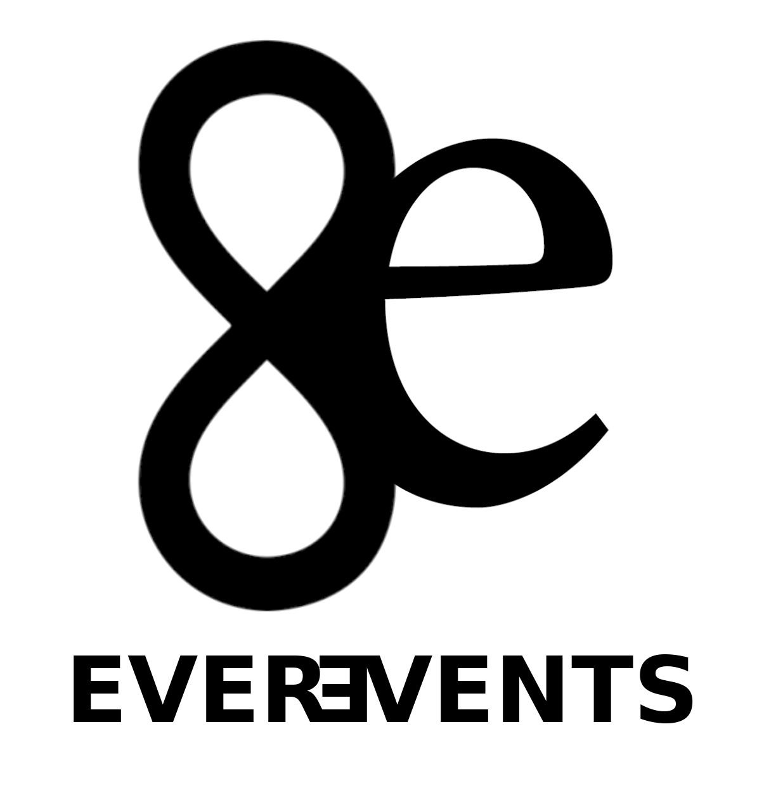
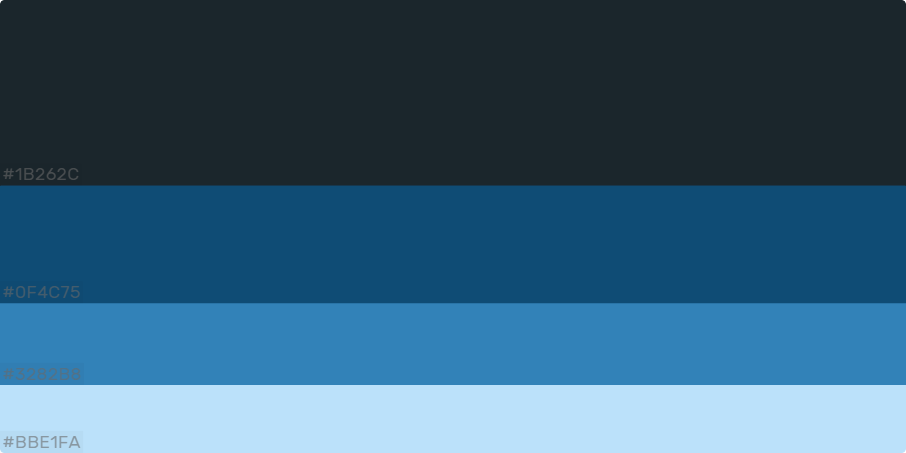
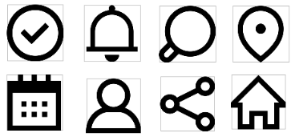

# DIU20
Prácticas Diseño Interfaces de Usuario 2019-20 (Economía Colaborativa) 

Grupo: DIU3.AMRM.  Curso: 2019/20 

Proyecto: EVEREVENTS

Descripción: EVEREVENTS es una applicacion mediante la cual vas a poder disfrutar de organizaciones y eventos al rededos de ti, ofrecidos por cualquier persona, local o perfiles verificados. Ademas tu tambien puedes crear tu evento o perfil. Y todos esto sin ningun coste!

Miembros
 * :bust_in_silhouette:   Antonio Manuel Rodriguez Martos    :octocat:  [suribel](https://github.com/suribel)

----- 

En esta práctica estudiaremos un caso de plataforma de economía colaborativa y realizaremos una propuesta para su diseño Web/movil. Utilizaremos herramientas y entregables descritos en el siguiente CheckList (https://github.com/mgea/UX-DIU-Checklist) 

Qué es economia colaborativa: Martínez-Polo, J. (2019). **El fenómeno del consumo colaborativo: del intercambio de bienes y servicios a la economía de las plataformas**, *Sphera Publica, 1*(19), 24-46. http://sphera.ucam.edu/index.php/sphera-01/article/view/363/14141434

# Proceso de Diseño 

## Paso 1. UX Desk Research & Analisis 

Proceso detallado [aquí](https://github.com/suribel/DIU20/blob/master/P1/README.md)

 1.a Competitive Analysis
-----

Para hacer el análisis competitivo primero tuvimos que mirar que aplicaciones hacen lo mismo que nosotros queríamos desarrollar y tras tener una lista nos decantamos finalmente por hacer dicha comparación con meetup, ya que era la más usada y la que más recorrido tenía, por tanto era de la que más datos podríamos sacar.

 1.b Persona
-----

Para poder identificar los objetivos y puntos débiles de la app decidimos presentar a dos personas ficticias y , Francisco y Harley, un chico de mediana edad y una chica joven.

 1.c User Journey Map
----

Tras presentar a los los dos personajes ficticios, pasamos a crear una historia a cada uno con objetivos diferentes utilizando la aplicación que comparamos para así obtener los datos relevantes sobre sus funcionalidades.

 1.d Usability Review
----

Finalmente hacemos un análisis exhaustivo acerca de los diferentes apartados de usabilidad de la aplicación que comparamos.
Valoración 77/100. 

## Paso 2. UX Design  

Proceso detallado [aquí](https://github.com/suribel/DIU20/blob/master/P2/README.md)

 2.a Feedback Capture Grid
----

Después nos pusimos a organizar de mejor manera los datos que habíamos obtenido en el análisis anterior. Creamos una malla receptora información  para visualizar mejor las ideas que queríamos mantener, las que queríamos evitar y las nuevas. En este punto sacamos ideas muy interesantes para desarrollar.

 2.b Tasks & Sitemap 
-----

Antes de comenzar los bocetos, primero definimos que funcionalidades y perfiles de usuario eran más relevantes de cara al uso de la aplicación, esto lo conseguiremos a través de una simple tabla donde podremos ver fácilmente lo anterior.

A través del sitemap mostraremos una visión general de forma jerárquica de como estarían estructuradas las páginas que componen a nuestra aplicación y su navegación.

 2.c Labelling 
----

Para que se entienda mejor cada página o etiqueta expuesta en el punto anterior haremos una lista y explicaremos o describiremos de forma más detallada la función de cada una.

 2.d Wireframes
-----

Finalmente terminamos este punto diseñando los bocetos iniciales de cada una de esas páginas que hemos definido.

## Paso 3. Mi equipo UX-Case Study 

 3.a ¿Como se cuenta un UX-Case Study?
-----

Aqui analizaremos 

  3.b Logotipo
----

El logotivo ha sido creado con el programada de edicion gratuito GIMP.
Creo que es un logo versatil para usar en cualquier entorno como redes sociales...

 3.c Guidelines
----

Para el diseño he optado por una línea de diseño basada en los estándares que ofrece android.

He decidido utilizar una paleta con colores azulados , predominando el oscuro para un visionado que no moleste y otros más claros que aportan frescura.
Esta la he obtenido de Colorhunt donde se difunden distintas paletas de colores y se hace un ranking de las mismas.
https://colorhunt.co/palette/167893

Para la fuente he decidido utilizar “Open Sans” y sus variables, a través de la web de Google Fonts, ya que me parece que sigue una línea estilizada acorde para la aplicación.
https://fonts.google.com/

Para los iconos también sigo la misma línea que se utiliza en android.
https://www.flaticon.es/packs/android-app-3

  3.d Video
----

>>> Documente y resuma el diseño de su producto en forma de video de 90 segundos aprox

## Paso 4. Evaluación 

 4.a Casos asignados
----

>>> Descripción de las asignaciones (3 UX Case Study) y enlace a  sus repositorios.

>>>> En la seccioón P4/readme.md se debe acceder además a sus respectivas hojas de evaluación y conclusiones 

 4.b User Testing
----

>>> Seleccione a una de sus personas ficticias. Exprese las ideas de posibles situaciones conflictivas de esa persona en las propuestas evaluadas

. 4.c Ranking 
----

>>> Concluya con un ranking de los casos evaluados 

>>> Valoración personal 

## Paso 5. Evaluación de Accesibilidad  

  5.a Accesibility evaluation Report
----

>>> Indica qué pretendes evaluar (de accesibilidad) y qué resultados has obtenido + Valoración personal

>>> Evaluación de la Accesibilidad (con simuladores o verificación de WACG) 

## Conclusión final / Valoración de las prácticas

>>> (90-150 palabras) Opinión del proceso de desarrollo de diseño siguiendo metodología UX y valoración (positiva /negativa) de los resultados obtenidos

