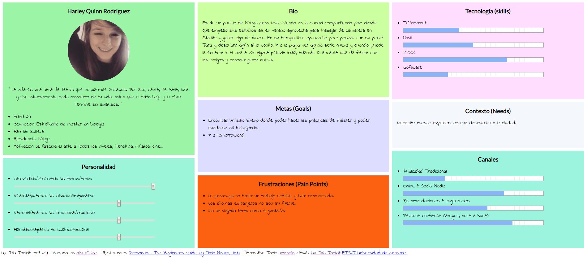
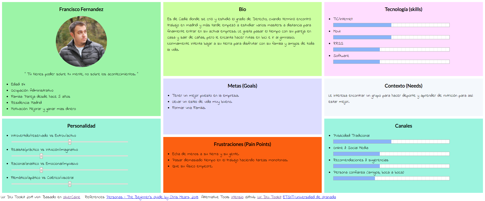
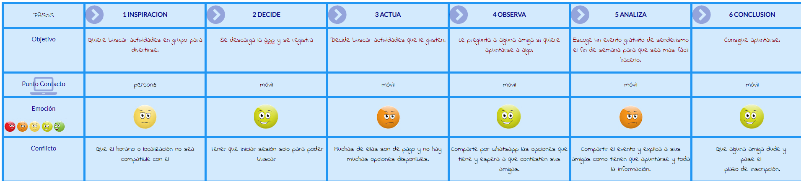
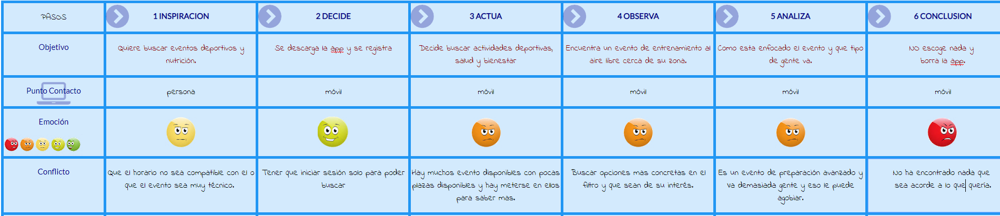

# DIU20
Prácticas Diseño Interfaces de Usuario 2019-20 (Economía Colaborativa) 

Grupo: DIU1_01AABB.  Curso: 2019/20 

Proyecto: 

Descripción: 

Logotipo: 

Miembros
 * :bust_in_silhouette:   Antonio Manuel Rodriguez Martos    :octocat:  [suribel](https://github.com/suribel)

----- 

En esta práctica estudiaremos un caso de plataforma de economía colaborativa y realizaremos una propuesta para su diseño Web/movil. Utilizaremos herramientas y entregables descritos en el siguiente CheckList (https://github.com/mgea/UX-DIU-Checklist) 

Qué es economia colaborativa: Martínez-Polo, J. (2019). **El fenómeno del consumo colaborativo: del intercambio de bienes y servicios a la economía de las plataformas**, *Sphera Publica, 1*(19), 24-46. http://sphera.ucam.edu/index.php/sphera-01/article/view/363/14141434

>>> Este documento es el esqueleto del report final de la práctica. Aparte de subir cada entrega a PRADO, se debe actualizar y dar formato de informe final a este documento online. 

# Proceso de Diseño 

## Paso 1. UX Desk Research & Analisis 

 1.a Competitive Analysis
-----

**Eatwith**: 
La podemos encontrar tanto en versión web como en app. Esta aplicación es para buscar o
crear experiencias culinarias, tanto tours gastronómicos como clases de cocina. Solo
tendremos que registrarnos, de forma muy rápida y sencilla y ya podremos ocupar el rol que
queramos. La interfaz es muy amigable y visualmente muy bonita, aunque cuenta con
mucha cantidad de información e imágenes, son de gran ayuda a la hora de decir.

**Meetup**:
También la podemos encontrar tanto en versión web como en app. En esta aplicación
podremos buscar o crear eventos de cualquier tipo. Solo tendremos que registrarnos, de
forma muy rápida e intuitiva, la información está organizada y explicada de forma muy clara,
tanto para buscar como para crear algún evento. A mi parecer su aspecto es un tanto sobrio
pero tiene muchas características, lo que ha veces puede llevarte perderte por la interfaz.
Meetup es la más conocida, la de más recorrido, la más versátil y la que personalmente yo
he utilizado y aunque visualmente no sea mi estilo, era la candidata que mejor me parecía,
por tanto ha sido la elegida.

 1.b Persona
-----

**Harley Quinn Rodriguez**: 
Esta persona es una joven que está en una etapa de la vida en la que empieza a pensar en
su futuro y en el empleo que quiere desarrollar con los estudios que ha realizado. Todavía
sigue bajando a casa de sus padres muchos findes, principalmente para no tener que
cocinar y llevarse tapers de comida. A nivel económico empieza a querer independizarse al
cien por cien de sus padres pero sabe que es complicado si se mete en el ámbito de la
investigación, por eso quiere empezar haciendo unas prácticas en alguna empresa para ver
que tal le va. Muchos de sus amigos han salido fuera de la ciudad en busca de otras
oportunidades, pero para ella no es problema salir y conocer gente nueva para lo que surja.
Su perra es una parte fundamental en su vida y a sus compañeras de piso también les
encanta aunque de vez en cuando la lie.

**Francisco Fernandez**: 
Esta persona es un hombre con un recorrido laboral aceptable que se encuentra cómodo
con su pareja y contento del lugar donde vive, pero que la personalidad de la gente que le
rodea en un su oficina no le gusta o comparte demasiado, por eso suele realizar la mayoría
de actividades de ocio con su novia Samantha. Sus expectativas son crecer en la empresa
y por tanto echa más horas de las que debería y eso le frustra. Hacer ejercicio y
preocuparse por su alimentación ocupa un lugar importante en su vida ya que de pequeño
sufrió de sobrepeso dado su metabolismo lento y no quiere verse mal.
Es una persona muy familiar y le gusta mantener conversaciones con sus amigos de toda la
vida. A veces le gustaría volver a Cadiz y trabajar allí pero sabe que en Madrid tiene un
puesto fijo y gana más dinero.

 1.c User Journey Map
----

He escogido situaciones variadas con personas con objetivos diferentes que pueden ocurrir
con facilidad.

 1.d Usability Review
----
>>>  Revisión de usabilidad: (toma los siguientes documentos de referncia y verifica puntos de verificación de  usabilidad
>>>> SE deben incluir claramente los siguientes elementos
>>> - Enlace al documento:  (sube a github el xls/pdf) 
>>> - Valoración final (numérica): 
>>> - Comentario sobre la valoración:  (60-120 caracteres)

## Paso 2. UX Design  

 2.a Feedback Capture Grid
----

>>> Comenta con un diagrama los aspectos más destacados a modo de conclusion de la práctica anterior,

 Interesante | Críticas     
| ------------- | -------
  Preguntas | Nuevas ideas
  
  
  
>>> ¿Que planteas como "propuesta de valor" para un nuevo diseño de aplicación para economia colaborativa ?
>>> Problema e hipótesis
>>>  Que planteas como "propuesta de valor" para un nuevo diseño de aplicación para economia colaborativa te
>>> (150-200 caracteres)

 2.b Tasks & Sitemap 
-----

>>> Definir "User Map" y "Task Flow" ... 

 2.c Labelling 
----

>>> Identificar términos para diálogo con usuario  

Término | Significado     
| ------------- | -------
  Login¿?  | acceder a plataforma

 2.d Wireframes
-----

>>> Plantear el  diseño del layout para Web/movil (organización y simulación ) 

## Paso 3. Make (Prototyping) 

 3.a Moodboard
-----

>>> Plantear Diseño visual con una guía de estilos visual (moodboard) 

  3.b Landing Page
----

>>> Plantear Landing Page 

 3.c Guidelines
----

>>> Estudio de Guidelines y Patrones IU a usar 

  3.d Mockup
----

>>> Layout: Mockup / prototipo HTML  (que permita simular tareas con estilo de IU seleccionado)

## Paso 4. UX Check (Usability Testing) 

 4.a A/B Testing
----

>>> Comprobacion de asignaciones para A/B Testing. Asignaciones https://github.com/mgea/DIU19/blob/master/ABtesting.md

>>>> Práctica A: 

 4.b User Testing
----

>>> Usuarios para evaluar prácticas 

| Usuarios | Sexo/Edad     | Ocupación   |  Exp.TIC    | Personalidad | Plataforma | TestA/B
| ------------- | -------- | ----------- | ----------- | -----------  | ---------- | ----
| User1's name  | H / 18   | Estudiante  | Media       | Introvertido | Web.       | A 
| User2's name  | H / 18   | Estudiante  | Media       | Timido       | Web        | A 
| User3's name  | M / 35   | Abogado     | Baja        | Emocional    | móvil      | B 
| User4's name  | H / 18   | Estudiante  | Media       | Racional     | Web        | B 

. 4.c Cuestionario SUS
----

>>> Usaremos el **Cuestionario SUS** para valorar la satisfacción de cada usuario con el diseño (A/B) realizado. Para ello usamos la [hoja de cálculo](https://github.com/mgea/DIU19/blob/master/Cuestionario%20SUS%20DIU.xlsx) para calcular resultados sigiendo las pautas para usar la escala SUS e interpretar los resultados
http://usabilitygeek.com/how-to-use-the-system-usability-scale-sus-to-evaluate-the-usability-of-your-website/)
Para más información, consultar aquí sobre la [metodología SUS](https://cui.unige.ch/isi/icle-wiki/_media/ipm:test-suschapt.pdf)

>>> Adjuntar captura de imagen con los resultados + Valoración personal 

 4.c Usability Report
----

>> Añadir report de usabilidad para práctica B 

## Paso 5. Evaluación de Accesibilidad  

  5.a Accesibility evaluation Report
----

>>> Indica qué pretendes evaluar (de accesibilidad) y qué resultados has obtenido + Valoración personal

>>> Evaluación de la Accesibilidad (con simuladores o verificación de WACG) 

## Conclusión / Valoración de las prácticas

>>> (90-150 caracteres) Opinión del proceso de desarrollo de diseño siguiendo metodología UX y valoración (positiva /negativa) de los resultados obtenidos  

